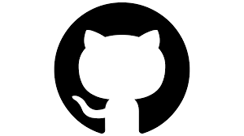
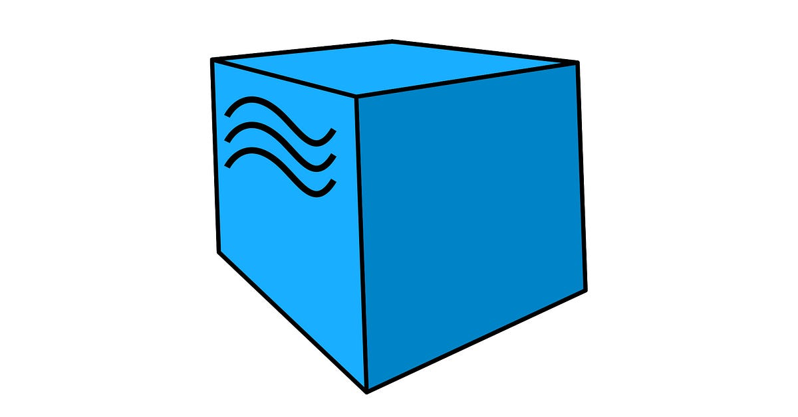
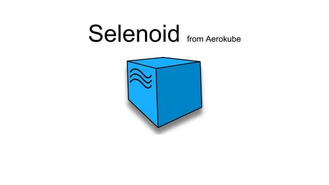
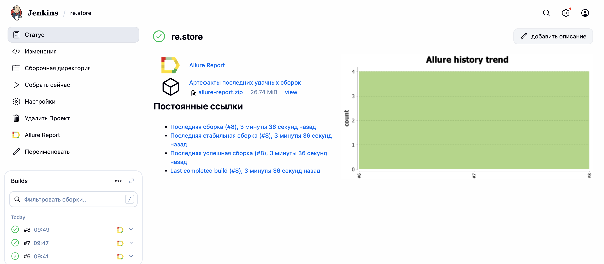

<h1>
  
  Проект по автоматизации тестирования сайта re:Store
</h1>
⸻
re:Store — официальный ритейлер техники Apple в России.
Проект направлен на автоматизацию UI-регрессионного тестирования сайта с использованием современного QA-стека и CI/CD.

Цели проекта:
⸻
•	проверка ключевых пользовательских сценариев
•	автоматический запуск тестов
•	генерация Allure-отчетов
•	уведомления о результатах в Telegram
•	интеграция с Jenkins
⸻
Содержание
⸻
•	Стек технологий
•	Сборка в Jenkins
•	Allure отчет
•	Уведомления в Telegram
•	Видео выполнения тестов (Selenoid)
•	Запуск тестов

Стек технологий
⸻

  
  
  
  
  
  
  
  
  
  
  

	•	Java — язык программирования
	•	JUnit 5 — тестовый фреймворк
	•	Selenide — UI-автоматизация
	•	Gradle — система сборки
	•	Allure — отчеты о тестировании
	•	Jenkins — CI/CD
	•	Selenoid — запуск браузеров в Docker
	•	Telegram Bot — уведомления о сборках
    •   Jira: Платформа для управления проектами и отслеживания задач.
    •   Allure TestOps: Платформа для управления тестированием и анализа результатов тестов.

<h2>
  
  Сборка в Jenkins
</h2>
⸻
Jenkins используется для автоматизации запуска тестов и генерации отчетов.

  

•	параметризованный запуск
•	автоматическая генерация Allure Report
•	история запусков
•	артефакты сборки
•	тренды прохождения тестов
Пример сборки в Jenkins:

